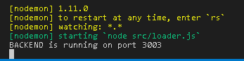

# Backend BillingCycle

Application to show the simplicity of creating a NodeJS API.
It has communication with MongoDB and is already enough for your Front End Consume.
Made based on the classes of the teacher [Leonardo Moura Leitão](https://www.youtube.com/watch?v=5sMBYBRwJ5Q&list=PLDm7BSK-M5YleJFYqnxvs7DZruSPmCgya).

## Getting Started

Have Installed on your machine:
[NodeJS](https://nodejs.org/en/) and [MongoDB](https://www.mongodb.com/download-center?jmp=nav#community)

### Install

```sh
git clone https://github.com/Cesar-Filho/BackendBillingCycle.git
cd BackendBillingCycle
npm install
mongoD
npm run dev
```


### Using in your Front End

To use create an .env file inside the "src" folder.
Create an AuthSecret for your file, for example:
> Module.exports = {
>
>     AuthSecret: 'skjdhf6 $$% dojkhf ^ (sdkjhf'
>    
>}

and save the file.

### Remember

Your Front End application that will consume the API will have to save the authentication in the browser's localStorage.

[Example](https://github.com/Cesar-Filho/ReactReduxCiclodePagamento/blob/master/src/auth/authReducer.js) made with React and Redux.

Good studies.
